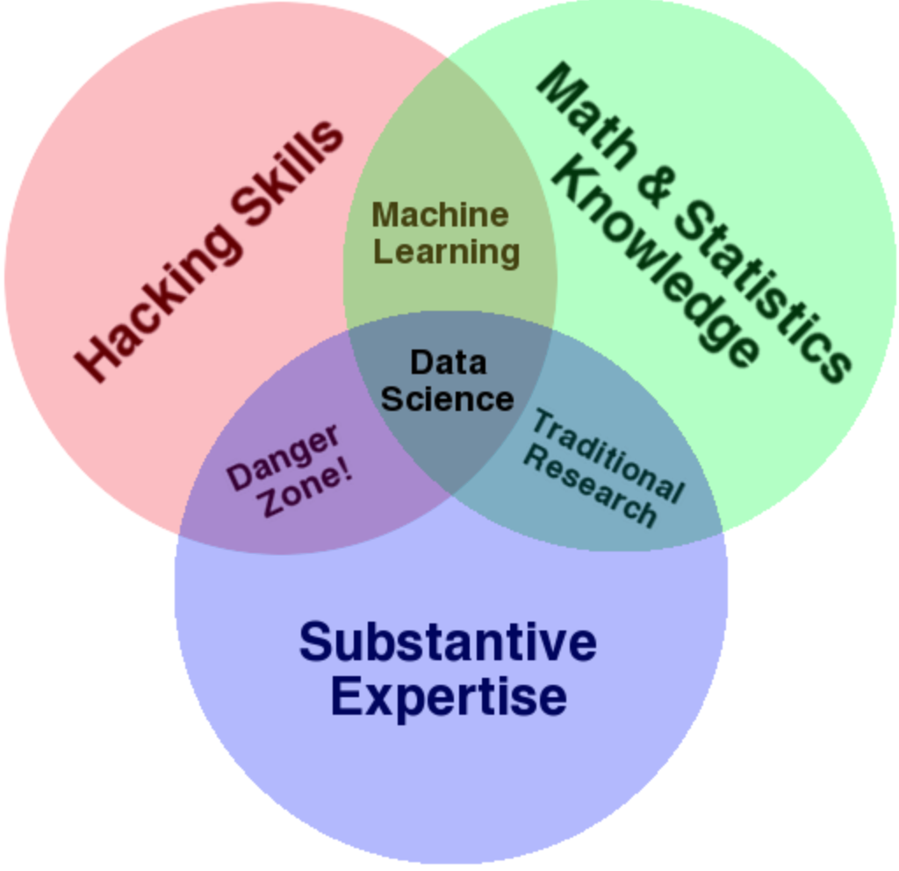
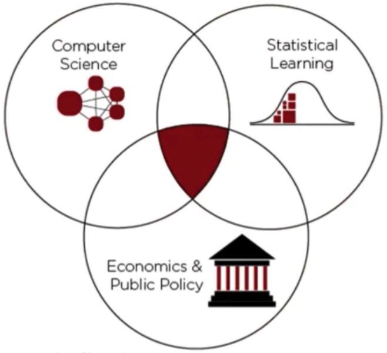
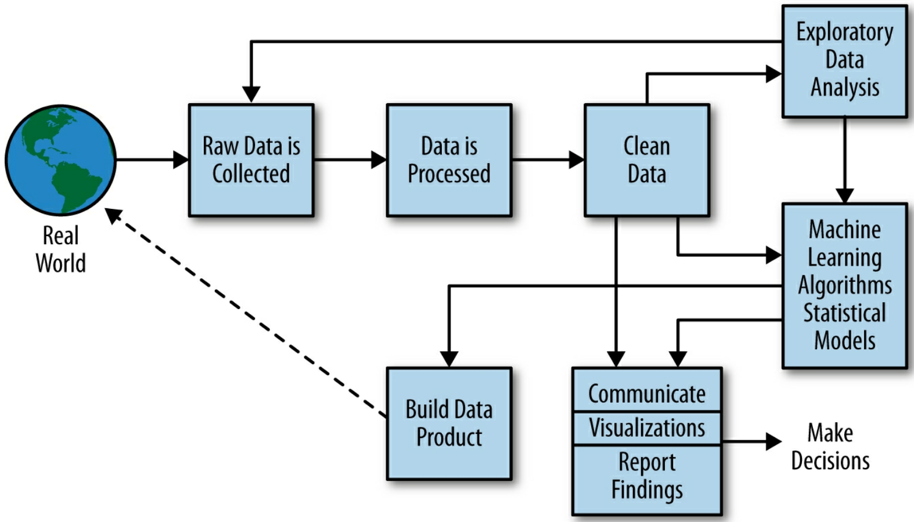
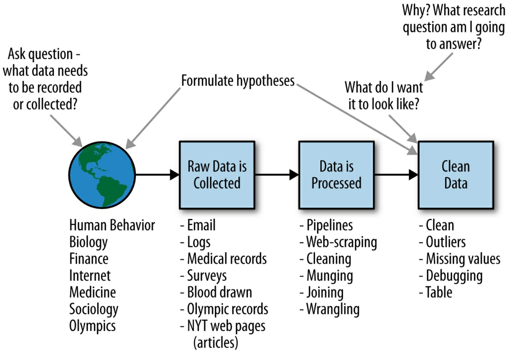
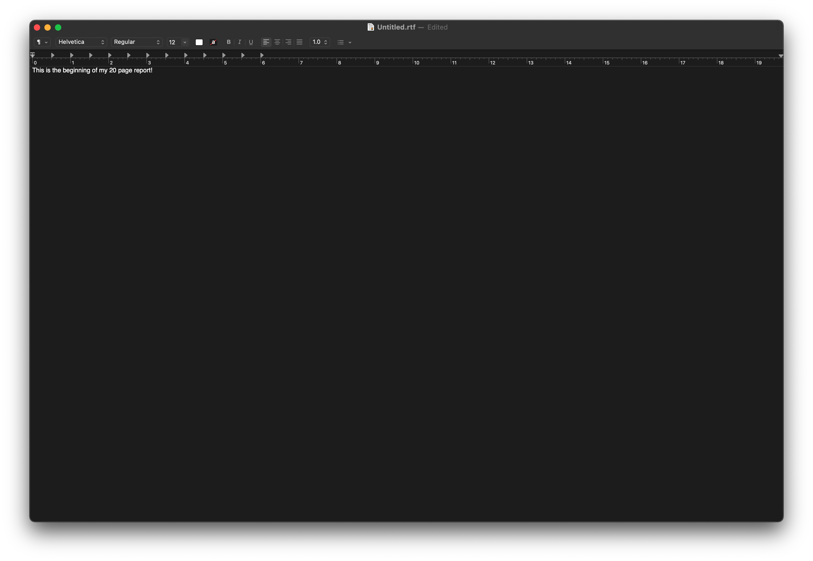
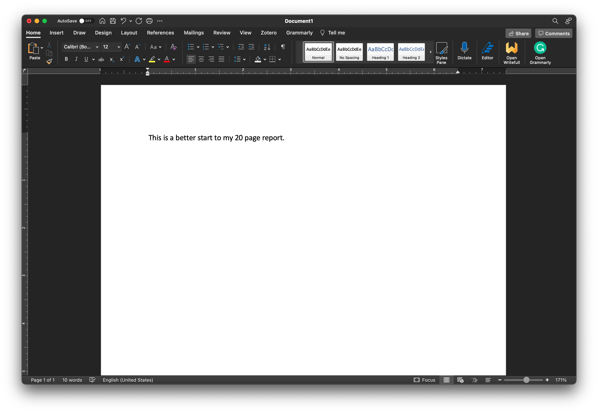

```{r setup, include=FALSE}
knitr::opts_chunk$set(echo = FALSE)
```

## What is Data Science?

-   Data science is an emerging field that combines important concepts from statistics, computer science, and substantive areas of focus.

<center>

{width="40%"}

</center>

-   Data science is the science of extracting meaning and information from data to change some outcome

## Data Science in Public Policy...?

-   Making effective policies requires data and data evaluation

    -   This is evidence-based policymaking

-   Regulation will likely require knowledge of data science tools and methods

## Data Science in Public Policy...?

<center>

{width="40%"}

</center>

## Data Science Questions?

-   **Easier questions:**

1.  What is spending on healthcare like in the United States?
2.  How have voting patterns for each party changed in recent years?

-   **Harder questions:**

3.  How do seat belt laws affect traffic fatalities? How can we reduce fatalities?
4.  Do job training programs reduce unemployment?

## Data Science is a Process

<center>

{width="70%"}

</center>

## The Data Scientist's Activity in the DS Process

<center>

{width="70%"}

</center>

## The Data Scientist's Toolbox

Data Processing and Cleaning

-   R, Python, SQL

Exploratory Data Analysis

-   R, Python

Data Analysis

-   Statistical Models, Machine Learning Algorithms

## `r fontawesome::fa("r-project", fill = "black")` The R Project

-   R is a programming language created by statisticians
-   Specifically designed for data analysis/statistics and data visualization
-   It's free! Download it here: <https://www.r-project.org>

## `r fontawesome::fa("python", fill = "black")` Python

-   Python is a programming language created by computer scientists

-   It is a general purpose language that can also be used for data analysis

-   It's free! Download it here: <https://www.python.org>

## SQL

-   SQL is a language for managing data bases

-   How would you deal with 20 terabytes of data that gets updated every hour?

    -   Yeah, that's why you need SQL

-   It has different dialectics, or flavors (MySQL, Oracle, Postgres

-   It's free! Download one dialect (MySQL) here: <https://mysql-com.en.softonic.com/download>

## Integrated Development Environments (IDEs)

Let's say you need to write a 20 page report. How will you write it?

## Integrated Development Environments (IDEs)

<center>

{width="80%"}

</center>

## Integrated Development Environments (IDEs)

<center>

{width="80%"}

</center>

## Integrated Development Environments (IDEs)

IDEs offer better tools to help you write code!

-   `r fontawesome::fa("r-project", fill = "black")` → RStudio
-   `r fontawesome::fa("python", fill = "black")` → PyCharm, Jupyter, RStudio
-   SQL → MySQL Workbench, Oracle SQL Developer, RStudio

## Workshop Overview

In this workshop series, we'll take on an example project and walk through the data science process of:

1.  Data cleaning

2.  Exploratory analysis

3.  Modeling

4.  Reporting Results

## `r fontawesome::fa("graduation-cap", fill = "black")` Workshop Learning Objectives

If you give an honest effort to solve each problem in this class, I promise that you will be able to do the follow at the end of the workshop:

1.  Prepare a clean data for analysis

2.  Identify patterns and visualize data

3.  Use statistical methods to test hypotheses

4.  Report your results in a reproducible manor

## What Data Science Tools are We Going to Use?

-   R, Python, and RStudio
