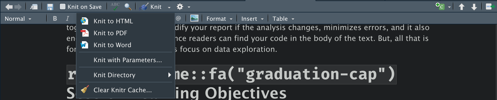
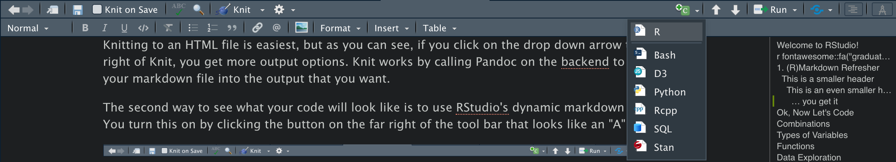

We'll be using R Studio for our workshop because it provides convenient support for both R and Python. It also provides an awesome visual markdown editor which allows you to see your markdown syntax compiled in real time.

Markdown is arguably THE best tool for reporting results and we will be making use of it during this workshop series. In the final workshop, we'll learn how we can use markdown to write dynamic documents, which are documents where you write up the results of your research with your code to produce all figures, tables, and models at the same time. Writing the code and prose together makes it easy to modify your report if the analysis changes, minimizes errors, and it also encourages reproducibility since readers can find your code in the body of the text. But, all that is for another day. For now, let's focus on data exploration.

# `r fontawesome::fa("graduation-cap")` Session Learning Objectives

1.  Work with RMarkdown to write code and report results

2.  Learn the basics of R and refresh your Python skills

3.  Clean a dataset for analysis

    -   Handle missing values
    -   Rename variables
    -   Create variables
    -   Pivot Data
    -   Separate Data

4.  Learn the "tidy data" phlisophy

# (R)Markdown Refresher

You create the biggest header using the `#` sign.

## This is a smaller header

### This is an even smaller header

#### ... you get it

-   This makes a bullet point

-   What about a numbered list?

1.  Just use numbers...

## Viewing Markdown

How can we see what this will look like when it's rendered? RStudio gives us two options. First, we can Knit the document by clicking the button on the tool bar that looks like this:



Knitting to an HTML file is easiest, but as you can see, if you click on the drop down arrow to the right of Knit, you get more output options. Knit works by calling Pandoc on the backend to render your markdown file into the output that you want.

The second way to see what your code will look like is to use R Studio's dynamic markdown editor. You turn this on by clicking the button on the far right of the tool bar that looks like an "A":


The last markdown tool you should know about for now, is that RStudio lets you see the document outline which can be helpful when writing a long document. To see it, click the button just to the left of the dynamic editor button:


Onwards!

To start a codeblock (where you would write code), you use three tick marks ```` ``` ```` followed by the language you want to write in curly brackets `{}` like this: ```` ```{r} ````. To close the block, you enter three tick marks on the line below (note that you have to have a space in between the start of the block and the end) ```` ``` ````.

Instead of adding a block manually, you can also use the little green insert button on the tool bar:



Here is what a block of R code looks like:

```{r}

```

Here is what a block of Python code looks like:

```{python}

```

# Learning R and Refreshing Python

R is just a really fancy calculator. Python is more general, but it can still preform the same calculations that R can. Let's start with some basic math in Python. To start, insert a Python code chunk:

```{python}
# let's start with addition
1 + 1
5 + 2

# notice the spaces between the + operator. This is considered good grammar. 
# It's a lot harder to read without spaces (it gets worse when we have 
# complex code).
1+1 # bad
5+2 # bad

# multiplication
4 * 8
5 * 19

# division
4 / 8
14 / 7

# power functions
4 ** 2
```

Now let's reproduce this in R:

```{r}
# addition
1 + 1
5 + 2

# multiplication
4 * 8
5 * 19

# division
4 / 8
14 / 7

# cubes
4 ^ 2
```

Everything was the same with the exception of the power function at the end. R using `^` and Python uses `**`.

The answers to each problem are shown at the bottom of the code block, but what if we wanted to save the answer to retrieve it later? This is where to concept of *assignment* comes in. When we make an assignment, we are creating an object that holds whatever we tell it to. In Python it looks like this:

```{python}
answer = 5 + 2

# again, note the spacing above. The spacing below is bad: 
answer=5+2 # bad
```

Now, if we want to see the answer to our operation, we just print the object we saved it to: `answer`:

```{python}
answer
```

Assignment works nearly the same way in R. The main difference is with the assignment operator. While the `=` works for assignment in R, it's considered bad practice to use it for assignment. Instead we use `<-` when making an assignment.

```{r}
answer <- 5 + 2
answer
```

The second different is that when making an assignment, R creates a copy

If you look in the environment pane, you will see the object (answer) that we created. You might also notice that the top left corner of the environment pane says R. If you click that, you'll see that you can also select Python to see all of the Python objects you've created.

### Exercises

1.  Insert a Python code chunk and calculate $17 \times 6$. Assign your answer to an object named `answer2`.
2.  Now do the same in R.

## Lists and Vectors

What if we wanted to combine several operations in one object? In Python, we accomplish this by creating a list:

```{python}
a = [1, 2, 3]
a
```

In R, we create a list with the `c` function and parentheses `()`.

```{r}
a <- c(1, 2, 3)
a

# we can include text instead of numbers and operations. Put text in quotations
text <- c("This", "Shows", "That we can also have text")
print(text)
```

In R, we mainly refer to these as vectors. Like Python, lists can contain text, text and numbers, or operations

```{r}
text <- c("This", "Shows", "That we can also have text")
text

b <- c(2, 5, "Text")
b

c <- c(3 + 3, 4 * 8, 17)
c
```

## Types of Variables

When you work with data, chances are you'll working with many different types of data at the same time. Consider this pandas DataFrame:

```{python}
import pandas as pd

data = pd.DataFrame(
  {"age": [33, 24, 42, 20, 19, 23],
   "education": ["High School", "Bachelors", "Bachelors", "High School", 
                 "Some College", "Grad School"],
   "surname": ["smith", "gonzales", "lee", "doe", "kim", "swanson"]}
)

data
```

Here we have three different types of data. `age` is clearly numeric and `education` and `surname` are strings. But, is there a difference between `education` and `surname`? `education` is best considered a *categorical* variable because each level of education is a different category. `surname` of the other hand isn't really categorical, it's just text.

We can check the data types of the DataFrame in Python like this:

```{python}
data.dtypes
```

For reasons that I won't explain here, pandas uses the type "object" for strings, so this is correct. What about with R? To recreate this data frame in R we use the `data.frame` function:

```{r}
r.data <- data.frame(
  age = c(33, 24, 42, 20, 19, 23),
  education = c("High School", "Bachelors", "Bachelors", "High School", 
                "Some College", "Grad School"),
  surname = c("smith", "gonzales", "lee", "doe", "kim", "swanson")
)

head(r.data)
```

The `head()` function shows the first 6 rows of data and at the top of each column you see the data type. It shows that `age` is of type `<dbl>` which stands for double and basically means that it's numeric data. `education` and `surname` are of type `<chr>` which means character, or string.

Earlier, I said that education should be a category, so why isn't it? R and Python can't really recognize the difference between strings and categories so we have to manually set it.

In Python, we can convert `education` to a categorical type with the .`astype("category")` method:

```{python}
data["education"].astype("category")
```

Now in R:

```{r}
r.data["education"] <- as.factor(r.data$education)
head(r.data)
```

In this R block, we used a new operator `$`. This operator allows us to access columns of a data frame. In an R block, try typing: `r.data$` then hit the Tab key. All of the columns are listed out. You can use the arrow keys to navigate to the one you want and hit Tab again.

Setting your data types correctly is an important aspect of data cleaning because it will make data visualization and analysis much easier down the line.

You can convert (also known as *casting* or *coercing*) a data frame column to other types data as well. These include numeric, character, integers, datetimes and more.

### Exercises

1.  Use R to coerce the `age` variable in `r.data` to an integer.
2.  Use Python cast the `age` variable as an integer. (Hint: the integer type in Python is `int64`)

## Getting Help!

Like the Python, the help options in R are very useful. If you place a `?` before any function, it will pull up a help menu:

```{r}
?mean()
```

### Exercise

1.  Create this vector in R: `vector <- c(123, 45, NA, 78, 17)`, the find the mean.

# Clean a Dataset for Analysis

Data cleaning (munging, or wrangling) is the primary task of any data science project. Data is really great for improving decisions, but only if it is in a usable format and only if we know what the data is measuring. There are a lot of different tasks involved in data cleaning, and in this workshop we will focus on three of the most important tasks:

-   Handling missing data
-   Renaming variables
-   Creating dummy variables

To see all of these tasks in action, lets get started with an actual dataset. The dataset that we'll being using for the remainder of this workshop is about flights to and from various destinations. Let's load it in with Python:

```{python}
flights_data = pd.read_csv("https://raw.githubusercontent.com/vaibhavwalvekar/NYC-Flights-2013-Dataset-Analysis/master/flights.csv")

flights_data.head()
```

Note that would can also load this data into R in a very similar way. First we'll load the `tidyverse` package, then load the data:

```{r}
library(tidyverse)
flights <- read_csv("https://raw.githubusercontent.com/vaibhavwalvekar/NYC-Flights-2013-Dataset-Analysis/master/flights.csv")

head(flights)
```

Of course, the read functions in Python and R also accept traditional file paths and file names instead of URLs like this:

```{r eval = FALSE}
read_csv("Documents/my_project/data.csv")
```

And, you can read in many other types of data with Python and R. Here is a table that shows the functions needed to read in other common file types:

| File Type                | R Function              | Python Function       |
|--------------------------|-------------------------|-----------------------|
| CSV                      | `readr::read_csv`       | `pandas.read_csv`     |
| Excel (`.xls` & `.xlsx`) | `readxl::read_excel`    | `pandas.read_excel`   |
| SPSS                     | `haven::read_spss`      | `pandas.read_spss`    |
| Stata                    | `haven::read_dta`       | `pandas.read_stata`   |
| SAS                      | `haven::read_sas`       | `pandas.read_sas`     |
| Feather                  | `feather::read_feather` | `pandas.read_feather` |

: Functions for Reading in Different Files

The beauty of using a tool like RStudio is that we don't have to only use R or only use Python. RStudio lets us use both languages to work with the same data. This is made possible by the `reticulate` package in R. After we load it in, we can use R and Python to interact with the same data. This is how it works:

```{r}
library(reticulate) # load the reticulate package

# to pull data loaded with Python in R, just use the preface py$
head(py$flights_data)
```

From now on we'll only be using the `flights_data` that we imported with Python. We'll also start to slowly transition to using R over Python.

## Missing Data

It's important to handle missing data correctly because missing values can influence analyses.

There are two types of missing data. The first is called "explicitly" missing data. Explicitly missing data values show up in R or Python as `NA` or `NaN` and these values tell you that there is no data for a given cell. Here is an example:

```{r}
df <- tibble(
  state = c("CA", "CA", "AZ", "AZ", "TX", "TX"),
  year = c(2000, 2001, 2000, 2001, 2000, 2001),
  enrollments = c(1521, 1231, 3200, 2785, 6731, NA)
)
df
```

It's clear that there is no data for Texas in 2001. But, what if there just was no row of data instead of an `NA` value? For example:

```{r}
df <- tibble(
  state = c("CA", "CA", "AZ", "AZ", "TX"),
  year = c(2000, 2001, 2000, 2001, 2000),
  enrollments = c(1521, 1231, 3200, 2785, 6731)
)
df
```

This would be known as an "implicitly" missing value. We don't have the data for Texas which, by definition, means that it's missing, but it's not explicit in the data. If we wanted to make it explicit, we could use the `complete()` function which fills out all possible values for a combination of variables:

```{r}
complete(df, state, year)
```

Sometimes explicitly missing values are coded as `-99` or `-999` and that can affect statistical summaries like the mean, median, and even correlations.

Both R and Python have default ways of handling missing values. In R, they are displayed as `NA` and in Python as `NaN`. Let's see an example of this:

```{python}
flights_data
```

#### What columns have missing values?

In Python we can calculate this by pairing `.isnull()` and `.any()` methods:

```{python}
flights_data.isnull().any()
```

Here we see that quite a few variables have missing values.

#### How many missing values are there?

```{python}
flights_data.isnull().sum()
```

We could replicate this with R code, by Python provides pretty good tools to answer these questions.

Next, let's look at the summary statistics for our data to check for any unusual values:

```{python}
flights_data.describe()
```

#### What should we do with missing values?

There really isn't a "right" way to handle missing values, so you just need to think carefully about whatever decision you make. The solution that we'll use here is just to drop all missing values. Why? Missing values can't be put in a plot or used in a regression, so we don't necessarily need them. Theoretically, missing values are important because it could mean something more that just "no data." For example, data might be systematically missing for a particular group of people. That would definitely affect our analyses and we would want to address it. That's a very different situation than having a missing value for a random, non-systematic reason.

Now that we've seen a small comparison of Python with R, we're going to start primarily using R to do the rest of our cleaning and exploration. We'll be using R's tidyverse specifically, which is a collection of packages that make R syntax easy to read, easy to type, and powerful.

So, let's drop all missing values, understanding that such a decision many not be the best for all situations. We'll accomplish this with the `drop_na()` function provided by the `dplyr` R package (one of the packages included in the tidyverse). We're also going to create a new object to save our changes to so that we can start building the dataset that we need to analysis and so that we can get back to our original data if needed.

```{r}
flights_no_na <- drop_na(py$flights_data)
```

How many rows did we drop? Let's check:

```{r}
# before dropping NAs
nrow(py$flights_data)

# after dropping NAs
nrow(flights_no_na)

# total rows dropped
nrow(py$flights_data) - nrow(flights_no_na)
```

Let's use Python to confirm that we dropped all missing values:

```{python}
r.flights_no_na.isnull().any()
```

Looks good!

## Renaming Variables

Another common data cleaning task is to rename variables. Sometimes variable names are completely uninformative - something like `CMP23A_001`. That doesn't make it any easier to understand the data. Let's check out the names of our variables in our dataset:

```{r}
colnames(flights_no_na)
```

These are actually pretty good, but we'll make some changes anyway. Most of our variable names have a `_` separator when they involve two words. `tailnum` is the exception. Let's rename this variable to `tail_num`.

To do this, we're going to make use of the "pipe" operator: `%>%`. This is a special operator that is used to chain multiple functions together. Chaining functions allows us to execute several operations quickly. I'll right out the code to rename `tailnum` below with comments to teach you what each step is doing:

```{r}
# first we make an assignment to save our changes
# since we want to use the same object name, we'll assign all of our changes to it
# this first line can be read aloud as: "create an object named 'flights_no_na'
# using the existing object 'flights_no_na' THEN ...
flights_no_na <- flights_no_na %>% 
  # rename NEW NAME = OLD NAME
  rename(tail_num = tailnum)

colnames(flights_no_na)
```

We'll also use this opportunity to drop the variable `Unnamed: 0` since it doesn't appear to contain any useful information. We can drop a variable with the `select()` function. `select()` is used to pick out only the variables that we want like this:

```{r}
flights_no_na %>% 
  select(origin, dest)
```

Here I only selected the `origin` and `dest` variables but I made no assignment. That means that I didn't make any changes to the `flights_no_na` data frame. See:

```{r}
head(flights_no_na)
```

All the variables are still there!

Now, to drop `Unnamed: 0` we can use a minus sign `-` in the select function like this:

```{r}
flights_no_na %>% 
  select(-`Unnamed: 0`) %>% 
  head()
```

A couple things to note here. First, I made no assignment so I didn't save our changes (i.e. `Unnamed: 0` is still in our original data frame). Second, check out the ``` `` ``` marks around `Unnamed: 0`. We need those because `Unnamed: 0` has white space and that makes R mad.

With all that in mind, let's drop `Unnamed: 0` once and for all by including an assignment in our code:

```{r}
flights_no_na <- flights_no_na %>% 
  select(-`Unnamed: 0`)
```

### Exercise

1.  Rename `dest` as `destination`.

## Creating Variables

Creating variables is easy with the `mutate()` function. Say we want to create a new variable that calculates the total delay (`tot_delay`) that is the sum of the departure delay (`dep_delay`) and the arrival delay (`arr_delay`) of each flight:

```{r}
flights_no_na <- flights_no_na %>% 
  mutate(tot_delay = dep_delay + arr_delay)
```

We can create more that one variable at a time like this:

```{r eval = FALSE}
flights_no_na <- flights_no_na %>% 
  mutate(tot_delay = dep_delay + arr_delay,
         tot_delay_alt  = (dep_delay + arr_delay) / 60)
```

`mutate()` can also be used to modify existing variables. For example, suppose we wanted to convert `carrier` to be a categorical type of data:

```{r}
flights_no_na <- flights_no_na %>% 
  mutate(carrier = as.factor(carrier))

head(flights_no_na)
```

### Exercise

1.  Use `mutate()` to compute the total air time for each flight (Hint: use `dep_time` and `arr_time`). Does this value equal the value in `air_time`. Why or why not?

# The "tidy data" Philosophy

The `flights` data we were working with is easy to work with because it's pretty much clean as is. In the real world, you'll almost never be so lucky. Data is easy to work with when it meets three conditions:


1.  Each variable has its own column.
2.  Each observation has its own row.
3.  Each value has its own cell.

Let's look at some example datasets to get a better sense of what I'm talking about.

```{r}
table1
```

Does each variable have its own column? Is each observation in a row? Does each value have its own cell?

What about these datasets?

```{r}
table2

table3

table4a
```

These are more typical of what you'll be working with in your own projects. To "tidy" these up, we'll need to learn a couple more tools:

-   pivoting

-   separating

## Pivoting Data

Pivoting data is when you rearrange either the rows or columns of your data to make it so that each column is a variable and each row is an observation. There are two types of pivots: longer and wider.

### Pivoting Longer

We need to pivot data to be longer when we have columns of data that represent values, not variables. `table4a` is a good example.

```{r}
table4a
```

Here, 1999 and 2000 are obviously the names of values (years) so they should share a single column. We can use `pivot_longer` to accomplish this:

```{r}
table4a %>% 
  pivot_longer(cols = c(`1999`, `2000`), names_to = "year", values_to = "value")
```

### Pivoting Wider

When we have multiple variables in a single column, we need to pivot our data wider. `table2` is a good example of this:

```{r}
table2
```

We can fix this with `pivot_wider`:

```{r}
table2 %>% 
  pivot_wider(id_cols = c(country, year), names_from = type, values_from = count)
```

### Exercises

1.  Use `pivot_wider` to pivot this data into a tidy format:

    ```{r}
    df <- tibble(
      state = c("CA", "CA", "AZ", "AZ", "TX"),
      year = c(2000, 2000, 2000, 2000, 2000),
      category = c("new_enrollments", "prev_enrollments", "new_enrollments",
                   "prev_enrollments", "new_enrollments"),
      count = c(1521, 30040, 3200, 45002, 5671)
    )
    ```

2.  Why is `prev_enrollments` show a missing value for Texas? If we wanted to fill in missing values with a value of `0`, how can we do that with `pivot_wider`?

3.  Use `pivot_longer` to tidy this data:

    ```{r}
    df <- tibble(
      state = c("CA", "AZ"),
      `2000` = c(1342, 2310),
      `2001` = c(1204, 2013)
    )
    ```

## Separating

Sometimes, a column of data will contain two values, which isn't good. `table3` shows an example:

```{r}
table3
```

Here, the `rate` variable is showing the number of cases divided by (`/`) the population. We can use `separate()` to make this a lot cleaner:

```{r}
table3 %>% 
  separate(col = rate, into = c("cases", "population"), sep = "/")
```

This is good, but notice that our new variables were classified to characters. That means they aren't treated as numbers. To fix this, we can use add in the `convert` argument and set it equal to `TRUE`. This will tell R to detect what type of data our new variables should be:

```{r}
table3 %>% 
  separate(col = rate, into = c("cases", "population"), sep = "/", 
           convert = TRUE)
```

No that they are a numeric type, we can add in a `mutate()` to calculate the actual rate:

```{r}
table3 %>% 
  separate(col = rate, into = c("cases", "population"), sep = "/", 
           convert = TRUE) %>% 
  mutate(rate = cases / population)
```

### Exercises

1.  Use `separate()` to tidy this dataset:

    ```{r}
    df <- tibble(
      state = c("CA", "CA", "AZ", "AZ", "TX", "TX"),
      year = c(2000, 2001, 2000, 2001, 2000, 2001),
      net_change = c("1521-30040", "2071-32040", "3200-45002", "2970-42412", 
                     "5671-67210", "5891-63610")
    )
    ```

## Save Your Cleaned Data

After working through your data cleaning, it's a good idea to save your cleaned data to a new file that we can import later to do more exploration and analysis.

Before saving, there is just one more issue to resolve in our data. Somewhere in the translation between Python and R, the variable `tailnum` became a list. Check it out:

```{r}
class(flights_no_na$tail_num)
```

Let's get that back to a regular character column.

```{r}
flights_no_na <- 
  flights_no_na %>% 
  unnest(tail_num)
```

Ok, all is right in the world now. Let's save the final dataset.

We can write our data to a CSV with the `write_csv()` function in R and specifying a file path to save it to:

```{r eval = FALSE}
write_csv(flights_no_na, "~/Documents/my_project/flights_cleaned.csv")
```

CSVs are a great general format, but there are other formats we could use as well. One format specific to R and Python is called "feather" which is a format designed by Wes McKinney (author of `pandas`) and Hadley Wickham (the principle author of the `tidyverse`) to be read by R and Python. Feather formats are fast and efficient.

```{r eval = FALSE}
library(feather)
write_feather(flights_no_na, "~/Documents/my_project/flights_cleaned.feather")
```

```{r include = FALSE}
write_csv(flights_no_na, "/Users/nickjenkins/Documents/Workshops & Conferences/Data-Science-Workshop/Winter 2022/data/flights_cleaned.csv")
```

# Summary

In this lesson we learned how R and Python can be used together to work with data in RStudio. While we only scratched the surface of R and the tidyverse, we saw how it has powerful data cleaning functions that will help prepare data for further analysis.

Next time, we'll learn how to visualize our data and identify patterns.

# Resources for Further Study

-   [R for Data Science](https://r4ds.had.co.nz/index.html)

-   [Python Data Science Handbook](https://jakevdp.github.io/PythonDataScienceHandbook/)

-   [Python for Data Analysis](%3Chttps://wesmckinney.com/pages/book.html)
